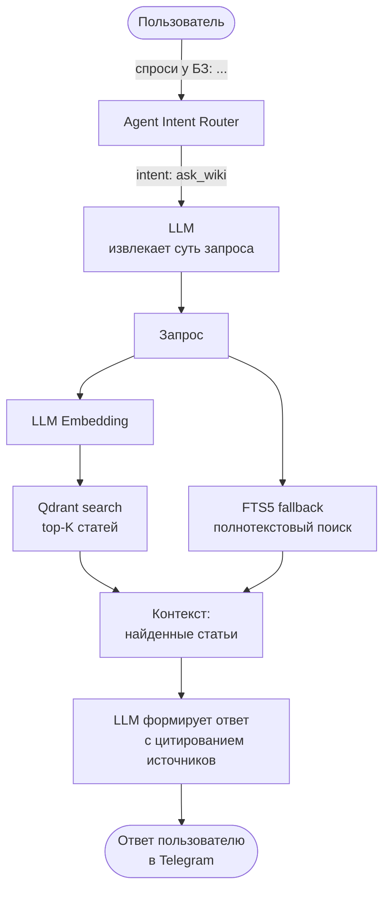
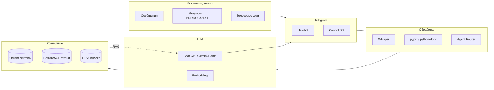

# Поток данных корпоративной Wiki в Telegram

## 1. Пополнение базы знаний (Write Flow)

```mermaid
flowchart TB
    User([Пользователь]) -->|сообщение / файл / голосовое| TG[Telegram]

    TG --> UBot[Userbot Telethon]
    UBot -->|зеркалит| DB[(PostgreSQL
        сырые сообщения)]
    UBot -->|скачивает PDF/DOCX/TXT/MD| Doc[Парсинг документов
        pypdf / python-docx]
    UBot -->|голосовые .ogg| Whis[Whisper
        распознавание речи]

    Doc -->|extracted_text| DB
    Whis -->|transcript| DB

    DB --> Handler[Обработчик aiogram
        команда "сохрани в БЗ"]
    Handler --> LLM[LLM Provider
        извлекает заголовок,
        категорию, теги]

    LLM --> Embed[LLM Embedding
        text-embedding-3-small
        / text-embedding-004]
    Embed --> Q[(Qdrant
        коллекция "wiki"
        COSINE distance)]

    LLM --> Pg[(PostgreSQL
        wiki_articles
        title, content,
        tags, category)]
    LLM --> Fts[(FTS5
        полнотекстовый
        индекс BM25)]
```

## 2. Чтение / Q&A (Read Flow)



## 3. Полная архитектура



## 4. Компоненты

| Компонент | Статус |
|-----------|--------|
| Telegram API (aiogram + Telethon) | Готово |
| LLM провайдеры (OpenAI, Gemini, Groq, GigaChat) | Готово |
| Векторное хранилище (Qdrant embedded) | Готово |
| Распознавание голоса (Whisper local/API) | Готово |
| Парсинг документов (PDF, DOCX, TXT, MD) | Готово |
| Полнотекстовый поиск (FTS5) | Готово |
| Суммаризация (LLM) | Готово |
| Agent / Intent routing | Готово |
| Модель данных wiki_articles + wiki_categories | Нужно добавить |
| RAG pipeline (контекст → ответ с цитированием) | Нужно добавить |
| Интенты "save_to_wiki", "ask_wiki" | Нужно добавить |
| Новая коллекция в Qdrant ("wiki") | Нужно добавить |
| UI: команды /wiki_save, /wiki_ask, /wiki_list | Нужно добавить |

## 5. Резюме — два конвейера

**Ingestion Pipeline:** `Telegram → Userbot → DB → LLM (embed) → Qdrant`

**Retrieval Pipeline:** `Telegram → Agent → LLM (embed) → Qdrant (search) → LLM (answer) → Telegram`
